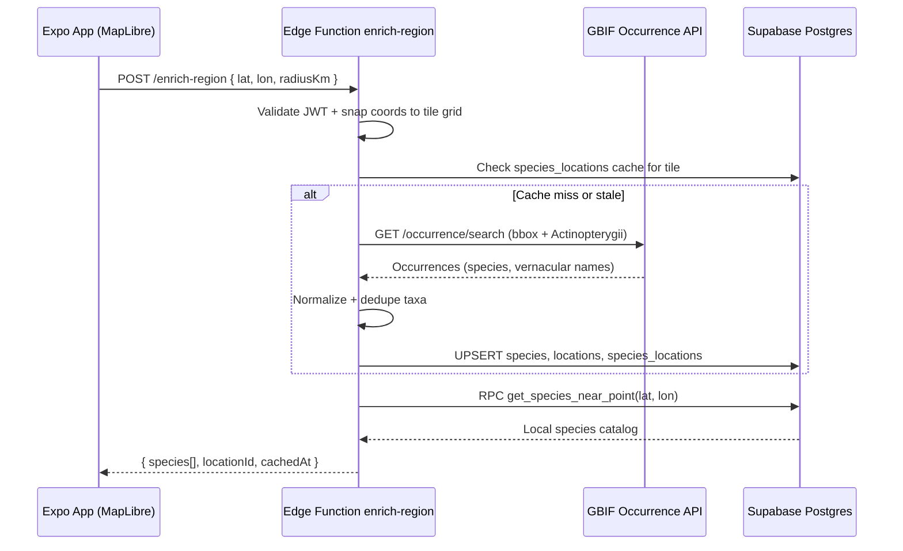

# GBIF Edge Function — Architectural Plan

This document outlines how a Supabase Edge Function will enrich the **Worldwide Fishing Forecast & Recommendation Engine** by querying external biodiversity APIs and persisting results into the normalized schema defined in `supabase/migrations/20260705183000_003_fishing_engine_schema.sql`.

---

## Goals

1. Accept a user's MapLibre coordinates (`latitude`, `longitude`).
2. Discover locally relevant fish species via **GBIF** (primary) and optionally **FishBase** (enrichment).
3. Upsert rows into `species`, `locations`, and `species_locations` so the mobile app improves as users explore new map regions.
4. Never expose the Supabase `service_role` key to the client.

---

## High-Level Flow



---

## Function: `enrich-region`

**Path:** `supabase/functions/enrich-region/index.ts`  
**Runtime:** Deno (Supabase Edge Functions)  
**Auth:** Requires valid Supabase JWT (`Authorization: Bearer <access_token>`). Uses `service_role` only inside the function via `SUPABASE_SERVICE_ROLE_KEY`.

### Request

```json
{
  "latitude": 27.75,
  "longitude": -82.63,
  "radiusKm": 50,
  "waterType": "saltwater"
}
```

### Response

```json
{
  "locationId": "uuid",
  "species": [
    {
      "id": "uuid",
      "name": "Common Snook",
      "scientificName": "Centropomus undecimalis",
      "primaryBiome": "coastal_saltwater",
      "dataSource": "GBIF"
    }
  ],
  "cached": true,
  "fetchedAt": "2026-07-05T17:30:00Z"
}
```

---

## Step-by-Step Implementation

### 1. Tile-based caching (avoid redundant GBIF calls)

Mirror the app's spatial tile logic (`snapBBoxToTileGrid` in `lib/api/endpoints/spatialSpots.ts`):

- Snap `(lat, lon)` to a **0.25° grid cell** (~17 mi at the equator).
- Use the cell center as the canonical `locations.coordinates` point.
- Before calling GBIF, query `species_locations` joined to `locations` where `ST_DWithin` covers the tile center.
- Skip GBIF if the tile was enriched within the last **7 days** (store `created_at` on `species_locations` or add a `locations.enriched_at` column in a follow-up migration).

### 2. GBIF occurrence search

Primary endpoint:

```
GET https://api.gbif.org/v1/occurrence/search
  ?decimalLatitude={minLat},{maxLat}
  &decimalLongitude={minLon},{maxLon}
  &taxonKey=2044          # Actinopterygii (ray-finned fishes)
  &hasCoordinate=true
  &hasGeospatialIssue=false
  &limit=300
```

Processing rules:

| GBIF field | Maps to |
|---|---|
| `species` / `scientificName` | `species.scientific_name` |
| `vernacularName` | `species.name` (fallback to canonical name) |
| `speciesKey` | Dedup key (recommend follow-up column `gbif_taxon_key`) |
| Occurrence lat/lon cluster | `locations.coordinates` (tile center) |

Filter out non-fish noise by requiring `classKey = 2044` (Actinopterygii) or matching `order`/`family` against an allowlist (Perciformes, Salmoniformes, etc.).

### 3. Optional FishBase enrichment

FishBase has no stable public REST API. Practical options:

- **Phase 1:** Derive `ideal_temp_min` / `ideal_temp_max` from GBIF metadata + heuristic biome rules (same as current `fishingEngine.ts`).
- **Phase 2:** Batch-import FishBase CSV into a staging table, join on `scientific_name` inside the Edge Function.
- **Phase 3:** Use a third-party wrapper (e.g. rOpenSci `rfishbase`) from a scheduled cron function, not per-request.

Set `data_source = 'FishBase'` only when temperature/biome data comes from that enrichment pass.

### 4. Database upsert strategy

Use the **service role client** inside the Edge Function:

```typescript
import { createClient } from 'https://esm.sh/@supabase/supabase-js@2';

const supabase = createClient(
  Deno.env.get('SUPABASE_URL')!,
  Deno.env.get('SUPABASE_SERVICE_ROLE_KEY')!
);
```

**species** — upsert on `scientific_name`:

```sql
INSERT INTO species (name, scientific_name, primary_biome, data_source)
VALUES (...)
ON CONFLICT (scientific_name) DO UPDATE
  SET name = EXCLUDED.name
  WHERE species.name = 'Unknown';
```

**locations** — find-or-create by tile name + coordinates:

```sql
INSERT INTO locations (name, coordinates, water_type)
VALUES (
  'Grid 27.75,-82.63',
  ST_SetSRID(ST_MakePoint(-82.63, 27.75), 4326)::geography,
  'saltwater'
)
ON CONFLICT DO NOTHING;  -- add unique index on ST_SnapToGrid in follow-up migration
```

**species_locations** — upsert composite PK:

```sql
INSERT INTO species_locations (species_id, location_id, data_source)
VALUES (...)
ON CONFLICT (species_id, location_id) DO UPDATE
  SET data_source = EXCLUDED.data_source;
```

Service role bypasses RLS, so no client-side write policies are needed on catalog tables.

### 5. Infer `primary_biome` and `water_type`

| Signal | Rule |
|---|---|
| Client `waterType` param | Direct map to `water_type_enum` |
| GBIF `marine` / `brackish` flags | Override when present |
| Latitude + coastal heuristic | Map to `primary_biome_type` (reuse logic from `utils/fishingEngine.ts`) |
| Default | `unknown` / `freshwater` |

### 6. Wire into the mobile app

Replace bundled-only forecast paths with a hybrid model:

1. **Immediate:** Local rule engine (`getFishingForecast`) for instant UI.
2. **Background:** Call `enrich-region` when the map camera settles on a new tile.
3. **Read path:** Query `get_species_near_point(lat, lon)` via Supabase RPC for data-driven species lists.
4. **Crowdsourcing:** Authenticated users write to `catch_logs`; the app calls `get_catch_activity_near_point` to boost activity scores and surface top lures.

---

## Security Considerations

| Concern | Mitigation |
|---|---|
| GBIF rate limits | Tile caching + 7-day TTL |
| Service role exposure | Edge Function only; never ship to Expo client |
| Catch log privacy | RLS restricts raw rows to owner; aggregates via `SECURITY DEFINER` RPC |
| Input validation | Clamp `radiusKm` ≤ 100; reject invalid lat/lon |
| Cost control | Debounce enrichment to one call per tile per user session |

---

## Deployment Checklist

1. Apply migration: `supabase db push` or run SQL in the Supabase dashboard.
2. Verify PostGIS: `SELECT PostGIS_Version();`
3. Scaffold function: `supabase functions new enrich-region`
4. Set secrets: `SUPABASE_SERVICE_ROLE_KEY`, optional `GBIF_USER_AGENT`
5. Deploy: `supabase functions deploy enrich-region --no-verify-jwt` *(or require JWT)* 
6. Add Expo hook: `useEnrichRegion(lat, lon)` with TanStack Query `staleTime: 7 days`
7. Monitor: Supabase function logs + GBIF 429 responses

---

## Follow-Up Migrations (recommended)

| Addition | Why |
|---|---|
| `species.gbif_taxon_key bigint UNIQUE` | Stable dedup across GBIF API versions |
| `locations.enriched_at timestamptz` | TTL cache without scanning join table |
| Unique index on `ST_SnapToGrid(coordinates::geometry, 0.25)` | Prevent duplicate grid locations |
| Materialized view `species_activity_summary` | Pre-aggregate catch_logs for forecast scoring |

---

## Related Code (current repo)

- Spatial tile snapping: `project/lib/api/endpoints/spatialSpots.ts`
- GBIF bbox fetch (BFF fallback): same file, `fetchGbifSpotsInBBox`
- Local forecast engine: `project/utils/fishingEngine.ts`
- Legacy catch storage: `catches` table + `project/utils/storage.ts` (migrate to `catch_logs` when auth ships)
